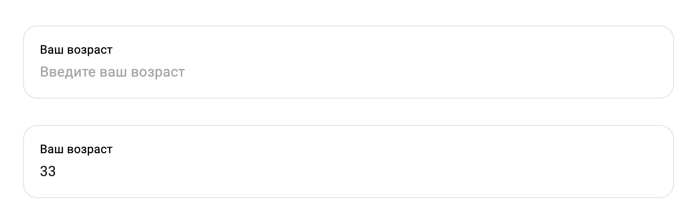

# x5.io — React UI Components Kit "Flat"

Реюзабельные компоненты "Flat" для интерфейса на React.

## Требования

1. React 18.0.0 и выше
2. Поддержка MUI (обратите внимание на [SSR](https://mui.com/material-ui/guides/server-rendering/))

## Установка

1. Следуйте инструкциям в <https://gitlab.com/x5.io_npmjs_components/getting-started>, чтобы получить доступ к компоненту на npmjs.com
2. `npm install @x5io/flat-uikit`
3. Компонент использует шрифт Gilroy

## Компоненты

### Кнопка (Button)

| Проп                                | Тип     | Описание                                              |
| ----------------------------------- | ------- | ----------------------------------------------------- |
| className                           | string? | Строка с классами, объединяется с дефолтными классами |
| [все остальные пропы от MUI/Button] | -       | -                                                     |

Пример:
```tsx
import Button from '@x5io/flat-uikit/dist/button'

<Button onClick={() => alert('foobar')}>Hello world!</Button>
```

### Чекбокс (Checkbox)


| Проп                           | Тип     | Описание                   |
| ------------------------------ | ------- | -------------------------- |
| value                          | boolean | Отмечен ли чекбокс         |
| name                           | string  | Название, html проп        |
| error                          | string? | Ошибка поля                |
| maxWidth                       | number? | Максимальная длина надписи |
| [все остальные HTML-аттрибуты] | -       | -                          |

Пример:
```tsx
import Checkbox from '@x5io/flat-uikit/checkbox'

const [isChecked, setIsChecked] = React.useState(false)

<Checkbox 
  value={isChecked} 
  onChange={setIsChecked}
  maxWidth={398}
  error={!isChecked && 'Отметьте поле'}
>
  Подпись к чекбоксу
</Checkbox>
```

### Поле для ввода (Input)



| Проп                                   | Тип                                              | Описание                              |
| -------------------------------------- | ------------------------------------------------ | ------------------------------------- |
| error                                  | string?                                          | Ошибка поля                           |
| onEnter                                | (e: React.KeyboardEvent<HTMLDivElement>)? => any | Событие, если нажимается кнопка Enter |
| [все остальные пропы от MUI/TextField] | -                                                | -                                     |

Пример:
```tsx
import Input from '@x5io/flat-uikit/dist/input'

const [value, setValue] = React.useState('')

<Input 
  value={value}
  onInput={e => setValue(e.target.value)}
  onEnter={() => alert('Done!')}
/>
```

## Сборка

1. Прочитайте общие инструкции в <https://gitlab.com/x5.io_npmjs_components/getting-started>
2. Сборка с TypeScript: `npm run build`
3. (Не рекомендуется) Сборка, игнорируя ошибки tsc: `node build.mjs`